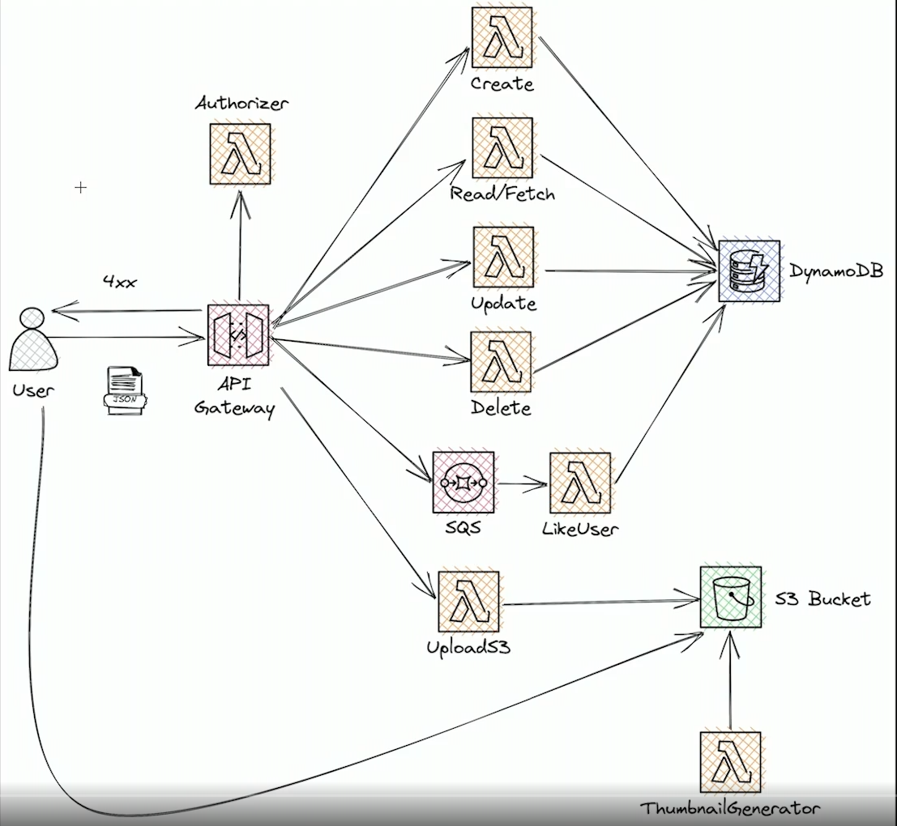

Para ejecutar en local y enviar a la nube se debe setear las access key y secret access key en tu terminal con el comando:

`aws configure`

y luego instalar las dependencias con

`npm install`

y desplegar usando el comando

`sls deploy`

con esto estaria desplegado pero puede arrojar errores ya que no tendria acceso a la tabla, para esto debes actualizar en el archivo serverless.yml la propiedad Reosurce dentro de statements en iam, para ubicar le valor del resource ve en tu cuenta de aws a dynamodb -> tables -> usersTable y copia el valor de Amazon Resource Name (ARN) t reemplazalo en el Resource.

Para usarlo de manera local puedes usar el comando

`sls offline start`

y con esto estarian los endpoints disponibles



Lo siguiente no es necesario si se hace con github actions

Script para crear layer

```
#!/bin/bash
npm i --omit=dev
mkdir nodejs/
mv node_modules/ nodejs/
zip -r nodejs-layer.zip nodejs/
rm -rf nodejs/
```

Script par subir layer

```
#!/bin/bash
aws lambda publish-layer-version --layer-name my-first-layer \
--description "My first layer for lambda with nodejs" \
--license-info "MIT" \
--zip-file fileb://nodejs-layer.zip \
--compatible-runtimes nodejs18.x \
--compatible-architectures x86_64 \
```
